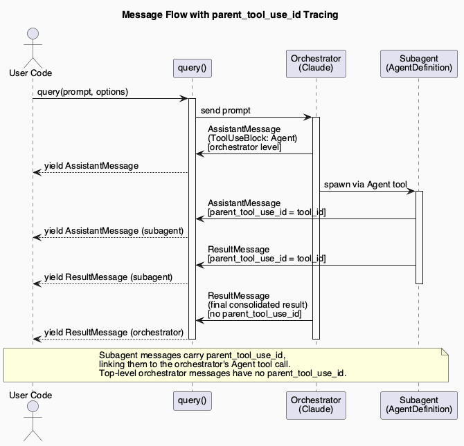
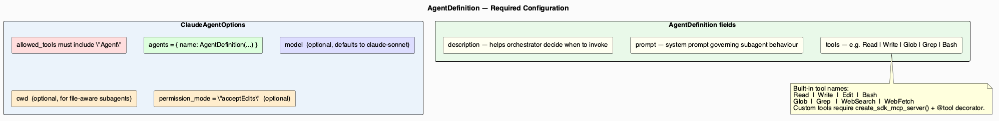
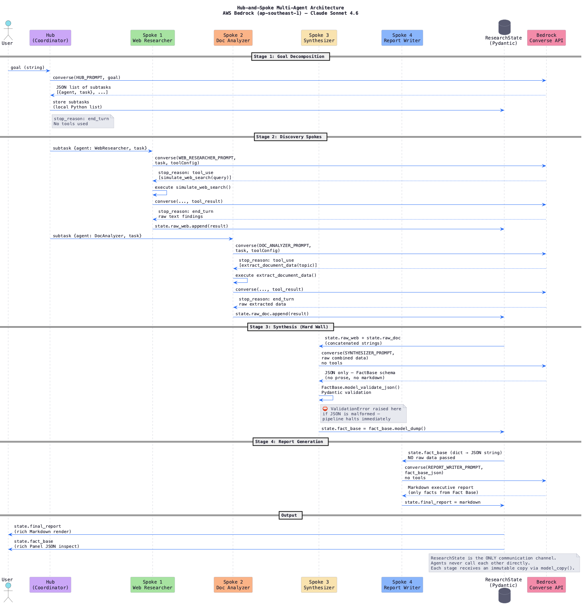
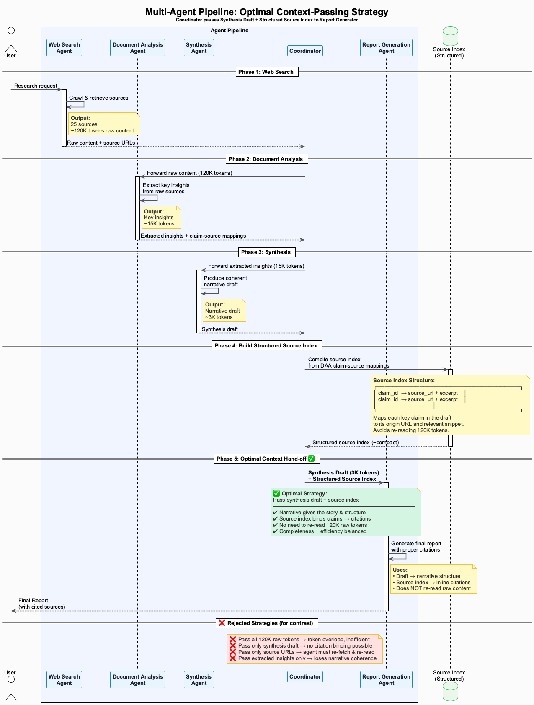
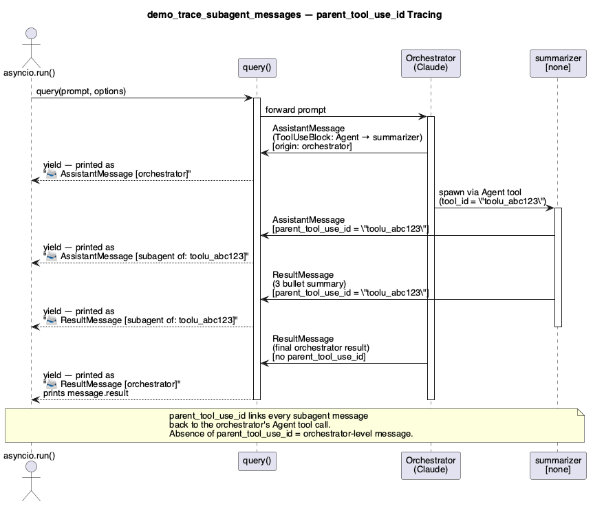
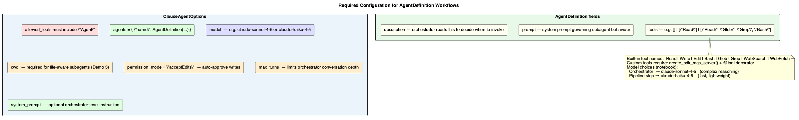
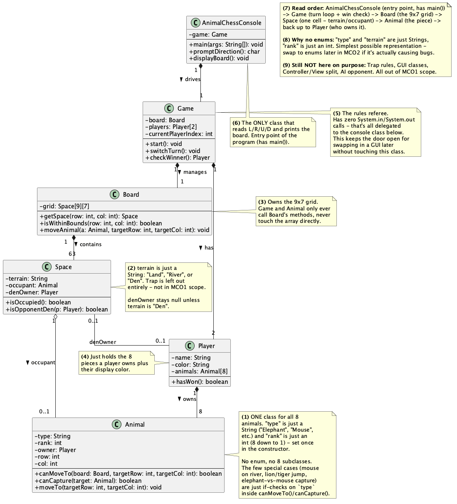

# Kayne's Claude Bedrock API Portfolio

Hands-on explorations of the Claude ecosystem — API fundamentals, prompting & tool use, Claude Code workflows, and Model Context Protocol basics.

Each folder maps to one exam domain from the **Claude Certified Architect – Foundations** certification.

---

## Repository Layout

```
01-claude-api-fundamentals/
02-prompting-and-tool-use/
03-claude-code-workflows/
04-mcp-basics/
```

Every domain folder follows the same structure:

```
<domain>/
├── notebooks/   Jupyter notebooks — runnable end-to-end examples
├── diagrams/    PlantUML source files (.puml)
└── images/      Rendered PNG exports of all diagrams
```

---

## 01 · Claude API Fundamentals

> SDK setup, agent definitions, message lifecycle, `stop_reason`, and Bedrock Converse API.

### Notebooks

| Notebook | Description |
|----------|-------------|
| [stop_reason_demo.ipynb](01-claude-api-fundamentals/notebooks/stop_reason_demo.ipynb) | Understanding every `stop_reason` value returned by Claude on AWS Bedrock and what each signals about model behaviour |
| [hub_spoke_bedrock.ipynb](01-claude-api-fundamentals/notebooks/hub_spoke_bedrock.ipynb) | Hub-and-spoke multi-agent architecture on AWS Bedrock using the Converse API (ap-southeast-1, Claude Sonnet 4.6) |

### Diagrams

| Preview | Source | Description |
|---------|--------|-------------|
|  | [claude_agent_definitions_p1_architecture.puml](01-claude-api-fundamentals/diagrams/claude_agent_definitions_p1_architecture.puml) | SDK class model and the four core agent patterns |
|  | [claude_agent_definitions_p2_message_flow.puml](01-claude-api-fundamentals/diagrams/claude_agent_definitions_p2_message_flow.puml) | `parent_tool_use_id` message tracing between orchestrator and subagents |
|  | [claude_agent_definitions_p3_config_reference.puml](01-claude-api-fundamentals/diagrams/claude_agent_definitions_p3_config_reference.puml) | `ClaudeAgentOptions` and `AgentDefinition` required fields quick-reference |
|  | [hub_spoke_bedrock.puml](01-claude-api-fundamentals/diagrams/hub_spoke_bedrock.puml) | Hub-and-spoke multi-agent topology on AWS Bedrock |

---

## 02 · Prompting and Tool Use

> Structured tool registries, multi-agent synthesis pipelines, context passing, and citation preservation.

### Notebooks

| Notebook | Description |
|----------|-------------|
| [financial_resolution_agent.ipynb](02-prompting-and-tool-use/notebooks/financial_resolution_agent.ipynb) | Financial resolution agent with a full tool registry, hook-driven control flow, and a deterministic agentic loop |

### Diagrams

| Preview | Source | Description |
|---------|--------|-------------|
|  | [context_passing_strategy.puml](02-prompting-and-tool-use/diagrams/context_passing_strategy.puml) | Optimal strategy for passing context between coordinator and sub-agents |
|  | [claims/claim-source.puml](02-prompting-and-tool-use/diagrams/claims/claim-source.puml) | Multi-agent claim-source synthesis with citation preservation |
|  | [claims/precedents-issue.puml](02-prompting-and-tool-use/diagrams/claims/precedents-issue.puml) | Coordinator-managed parallel subagents for legal precedent analysis |
|  | [claims/precedents-issue.puml](02-prompting-and-tool-use/diagrams/claims/precedents-issue.puml) | Parallel subagent coordination reducing latency via fan-out |

---

## 03 · Claude Code Workflows

> AgentDefinition demos, subagent lifecycle, multi-agent orchestration patterns, and applied class design.

### Notebooks

| Notebook | Description |
|----------|-------------|
| [claude_agent_definitions.ipynb](03-claude-code-workflows/notebooks/claude_agent_definitions.ipynb) | End-to-end walkthrough of `AgentDefinitions` — single subagent, multiple subagents, file-aware scanning, sequential pipeline, and message tracing |

### Diagrams

| Preview | Source | Description |
|---------|--------|-------------|
|  | [agent_definitions_demo_p1_demos.puml](03-claude-code-workflows/diagrams/agent_definitions_demo_p1_demos.puml) | All four notebook demo architectures side by side |
|  | [agent_definitions_demo_p2_tracing.puml](03-claude-code-workflows/diagrams/agent_definitions_demo_p2_tracing.puml) | Demo 5 — subagent message tracing sequence diagram |
|  | [agent_definitions_demo_p3_config.puml](03-claude-code-workflows/diagrams/agent_definitions_demo_p3_config.puml) | Configuration quick-reference for demo notebooks |
|  | [animal_chess/animal_chess_mco1.puml](03-claude-code-workflows/diagrams/animal_chess/animal_chess_mco1.puml) | Animal Chess (Jungle Chess) MCO1 full class diagram |
|  | [animal_chess/animal_chess_mco1_simple.puml](03-claude-code-workflows/diagrams/animal_chess/animal_chess_mco1_simple.puml) | Simplified phase-1 variant (movement only, no trap) |

---

## 04 · Model Context Protocol Basics

> MCP tool integration, resource interfaces, and certification reference material.

### Notebooks

The MCP tool registry and `@tool` decorator patterns are demonstrated inside the financial resolution agent:

→ [financial_resolution_agent.ipynb — Section 1: Tool Registry (MCP Integration)](02-prompting-and-tool-use/notebooks/financial_resolution_agent.ipynb)

### Docs

| File | Description |
|------|-------------|
| [claude-need-to-know.pdf](04-mcp-basics/docs/claude-need-to-know.pdf) | Claude Certified Architect – Foundations exam guide covering all four domains: Claude API, Prompting & Tool Use, Claude Code, and MCP |

---

## Prerequisites

```bash
pip install anthropic boto3 python-dotenv rich
```

AWS credentials configured for Bedrock notebooks (`ap-southeast-1`).
